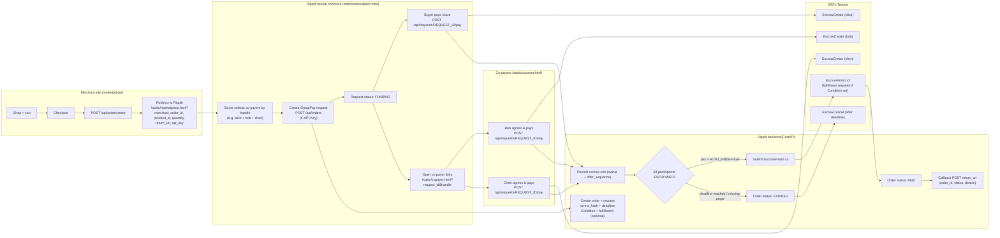
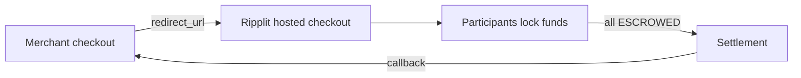
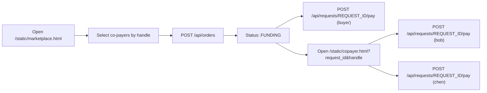

# Ripplit

Ripplit is a demo project for an XRPL group payment flow with escrow-based coordination.

It simulates a Stripe/PayPal-style hosted checkout called **GroupPay**: a merchant site redirects buyers to Ripplit, the buyer selects co-payers by handle (DID-style directory), each payer locks their share in an XRPL Escrow, and the backend finishes the escrows once everyone has paid.

Key ideas:
- **Coordination on XRPL** via `EscrowCreate` + `EscrowFinish` / `EscrowCancel` (Testnet).
- **Crypto-conditions** (PREIMAGE-SHA-256) optionally gate escrow release until the backend provides the fulfillment.
- **Auto-finish** can finalize the payment automatically once all participants have escrowed.

## Structure

- `project_structure.yaml`: File manifest used to generate the project tree.
- `app/`: FastAPI backend and GroupPay logic.
- `static/`: Hosted checkout and payer web views.
- `marketplace/`: Demo merchant storefront that redirects to the hosted checkout.
- `docs/`: Diagrams and docs assets (importable into Figma).
- `requirements.txt`: Python dependencies.

## How it works

1. A merchant storefront (optional) creates a cart order and redirects to the hosted checkout.
2. The hosted checkout (`static/marketplace.html`) creates a GroupPay request via `POST /api/orders`.
3. Each participant pays their share via `POST /api/requests/REQUEST_ID/pay` which submits an XRPL `EscrowCreate`.
4. When all participants are `ESCROWED`, the backend either:
   - auto-finishes the escrows (`AUTO_FINISH=true`), or
   - waits for a manual `POST /api/requests/REQUEST_ID/finish`.

Status progression: `PENDING → FUNDING → READY → PAID` (or `EXPIRED`).

## Diagrams

- `docs/ripplit-user-flow.svg`: Import into Figma (File → Import) for an editable user-flow diagram.
- `docs/ripplit-user-flow.mmd`: Mermaid source for the same diagram.

### Mermaid (full)

<details>
<summary>Show full diagram</summary>



</details>

### Mermaid (overview)



### Mermaid (checkout + payer steps)



### Mermaid (XRPL escrow + auto-finish)

```mermaid
flowchart LR
  EC1["EscrowCreate (alice)"] --> Q{"All ESCROWED?"}
  EC2["EscrowCreate (bob)"] --> Q
  EC3["EscrowCreate (chen)"] --> Q
  Q -- yes + AUTO_FINISH=true --> EF["EscrowFinish x3 (fulfillment if Condition set)"]
  EF --> PAID[Order: PAID]
  PAID --> CB[POST return_url callback]
  Q -- no + deadline passes --> EXP[Order: EXPIRED]
  EXP --> CAN[EscrowCancel (after CancelAfter)]
```

## Run locally

```bash
python3 -m venv .venv
source .venv/bin/activate
pip install -r requirements.txt
uvicorn app.main:app --reload --env-file .env
```

Open `http://127.0.0.1:8000/` to view the hosted checkout.

### Marketplace demo (optional)

Run the merchant storefront in a second terminal:

```bash
cd marketplace
uvicorn app:app --reload --port 8010
```

Open `http://127.0.0.1:8010/` to add items and redirect into the checkout.

## Hosted checkout (redirect)

The root page behaves like a Stripe/PayPal-style hosted checkout. You can pass
merchant context as query params so the UI looks like a redirect from a store:

```
http://127.0.0.1:8000/?merchant=Amazon&order_id=ORDER-123&product_id=RM-HEAD-01&quantity=2&return_url=https://merchant.example.com/return
```

- If `product_id` is provided, the item and quantity are locked.
- If `return_url` is provided, the checkout shows a “Return to merchant” link.
- If `API_KEY` is set, append `&api_key=YOUR_KEY` so the UI can call write APIs.

## XRPL configuration

By default the app runs in `mock` mode so you can demo the flow without Testnet
wallets. To use XRPL Testnet escrows, set these environment variables:

- `XRPL_MODE=testnet`
- `XRPL_JSON_RPC_URL=https://s.altnet.rippletest.net:51234`
- `MERCHANT_ADDRESS=...`
- `MERCHANT_SEED=...`
- `DEMO_ALICE_ADDRESS=...`, `DEMO_ALICE_SEED=...`
- `DEMO_BOB_ADDRESS=...`, `DEMO_BOB_SEED=...`
- `DEMO_CHEN_ADDRESS=...`, `DEMO_CHEN_SEED=...`

The app uses canonical PREIMAGE-SHA-256 crypto-conditions via `cryptoconditions`.

## Ledger polling and DID registry

When `XRPL_MODE=testnet`, the backend polls the ledger (default every 8s) to:

- detect EscrowCreate/Finish/Cancel transactions for the request
- keep the order status in sync with on-ledger activity
- refresh DID metadata for configured contacts

You can configure polling with:

- `LEDGER_POLL_SECONDS=8`
- `ENABLE_LEDGER_POLLING=true`
- `USE_LEDGER_DID=true`

To publish an on-ledger DID for a handle:

```bash
curl -X POST http://127.0.0.1:8000/api/did/register \
  -H "Content-Type: application/json" \
  -H "X-API-Key: YOUR_KEY" \
  -d '{"handle":"alice"}'
```

## API key auth (optional)

If you set `API_KEY=...`, write endpoints require the header `X-API-Key`.
You can pass it to the UI by appending `?api_key=YOUR_KEY` to the URL.

## Stripe-style redirect links

If a merchant backend creates the order, the response includes `checkout_urls`
for each payer:

```
/pay/{request_id}/{handle}
```

These redirect to the wallet page and can include `return_url` so payers can
return to the originating site after completing payment.

### Merchant API example

```bash
curl -X POST http://127.0.0.1:8000/api/orders \
  -H "Content-Type: application/json" \
  -H "X-API-Key: YOUR_KEY" \
  -d '{
    "product_id": "RM-HEAD-01",
    "quantity": 1,
    "participants": ["alice", "bob", "chen"],
    "split": "equal",
    "deadline_minutes": 15,
    "return_url": "https://merchant.example.com/return"
  }'
```
